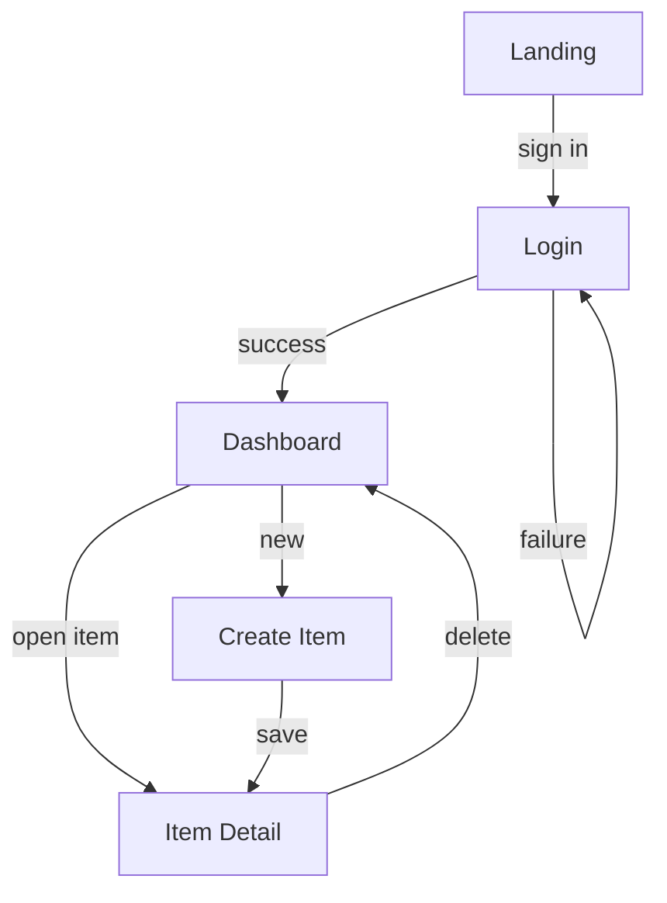

# App Flow - <Project Name>

<!--
Tier 1 blueprint doc. The screen map and the primary user journeys through it.
The point of this doc is to force the empty / loading / error states into the open BEFORE
build, because that is where most UI defects and most "we forgot that case" gaps live.
Delete guidance comments before shipping.
-->

| Field | Value |
|-------|-------|
| Owner | <!-- name --> |
| Last updated | <!-- YYYY-MM-DD --> |

## Screen map

<!-- Replace with your real screens and transitions. Label edges with the action that causes
the transition. Keep it to top-level screens, not every modal. -->

## Screens

<!-- One row per screen. Do NOT leave the state columns blank - an empty/loading/error cell
is a design gap, not a formatting gap. "Empty" = no data yet. "Loading" = fetch in flight.
"Error" = fetch or action failed. -->

| Screen | Purpose | Entry | Exit | Empty state | Loading state | Error state |
|--------|---------|-------|------|-------------|---------------|-------------|
| Dashboard | <!-- --> | <!-- from where --> | <!-- to where --> | <!-- no items yet copy/CTA --> | <!-- skeleton? spinner? --> | <!-- fetch failed copy + retry --> |
| Item Detail | <!-- --> | <!-- --> | <!-- --> | <!-- N/A or --> | <!-- --> | <!-- --> |
| Create Item | <!-- --> | <!-- --> | <!-- --> | <!-- --> | <!-- submit pending --> | <!-- validation + server error --> |

## Primary user flows

<!-- Number the critical journeys end to end. Each step is one screen or action. Call out
where an error or empty state branches the flow. -->

1. **<!-- Flow name, e.g. First-run onboarding -->**
   - Step 1: <!-- screen / action -->
   - Step 2: <!-- screen / action -->
   - Error branch: <!-- what the user sees if a step fails, and how they recover -->

2. **<!-- Flow name -->**
   - Step 1: <!-- -->
