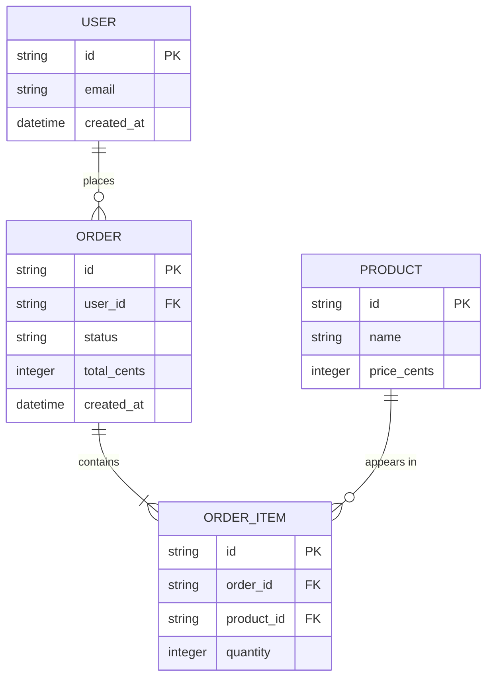

# Data Model - <Project Name>

<!--
Tier 1 blueprint doc. The canonical shape of the domain: entities, fields, relationships.
Keep it in sync with the actual migrations/schema. Delete guidance comments before shipping.
-->

| Field | Value |
|-------|-------|
| Owner | <!-- name --> |
| Last updated | <!-- YYYY-MM-DD --> |
| Source of truth | <!-- e.g. migrations/, schema.sql, Drizzle models --> |

## Entity relationship diagram

<!-- Replace the stub entities with your own. Keep it readable: types + keys, not every column.
Cardinality notation: ||--o{ is "one to zero-or-many", }o--|| etc. -->

## Entities

<!-- One row per field. PK/FK column: PK, FK, or blank. Notes: constraints, defaults,
enums, nullability, indexing. Add a table per entity or keep one table - your call. -->

| Entity | Field | Type | PK/FK | Notes |
|--------|-------|------|-------|-------|
| User | id | string | PK | <!-- uuid7 --> |
| User | email | string | | <!-- unique, not null --> |
| Order | id | string | PK | |
| Order | user_id | string | FK | <!-- -> User.id --> |
| Order | status | string | | <!-- enum: pending/paid/shipped --> |

## Relationships

<!-- Plain-language list of each relationship and its cardinality. Call out cascade rules
and soft-delete behaviour explicitly. -->

- A User has many Orders (one-to-many). <!-- deletion: soft-delete, see DECISION_LOG -->
- An Order has one or more Order Items (one-to-many, mandatory).
- A Product appears in zero or more Order Items.
